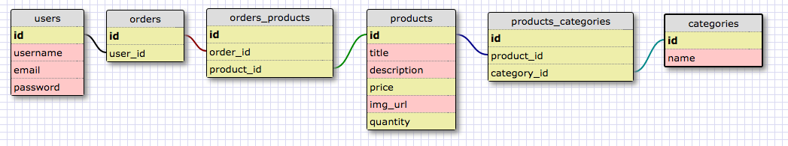
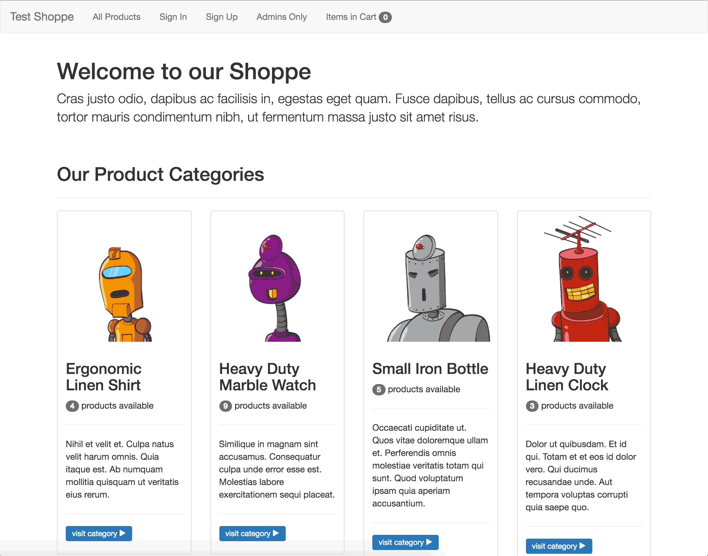
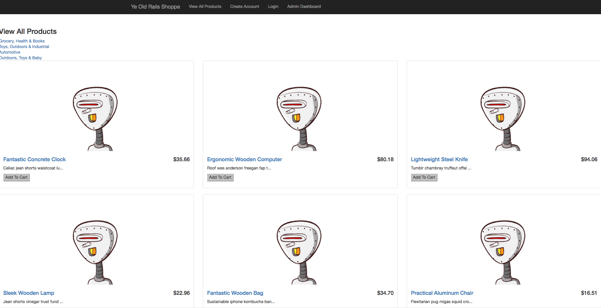
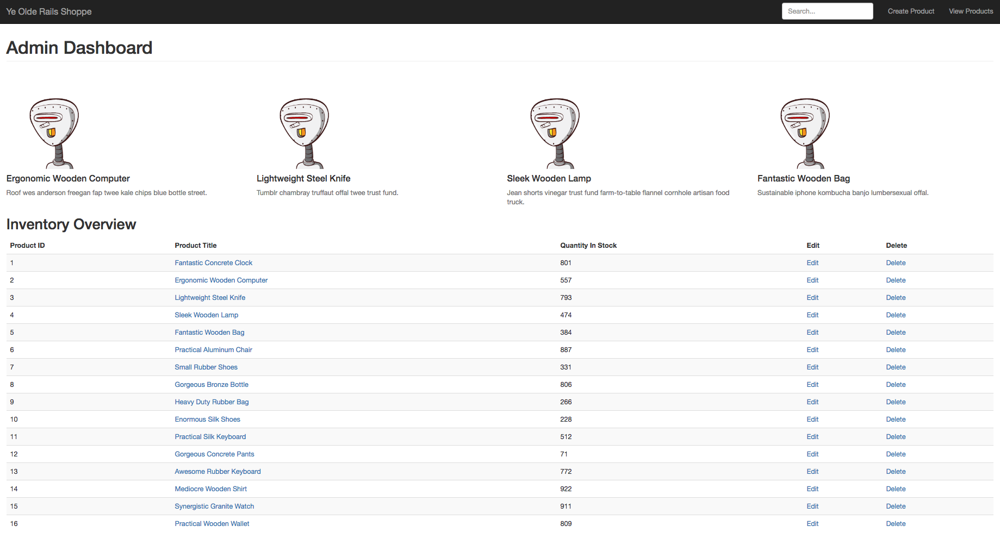
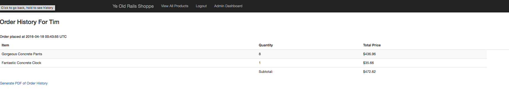

## Client Stories:
___
* Upon authentication, the admin can add, edit, delete and view a product from the store, which includes inventory level.
* The admin can view the remaining quantity in stock for each product.

* A shopper can register, log in, and add or remove items from cart.
* A shopper will receive an email upon registration.
* A shopper can view products by category, and see all categories that a given product belongs to.
* A shopper can view the cart's subtotal as it updates.
* A shopper can place an order, and will then receive a confirmation email.
* A shopper can view their order history as html or generate it as a PDF.

## Schema:

## Website:

#### Welcome Page:

#### Homepage:

#### Admin Dashboard:

#### Shopping Cart:

## Installation Notes:
* ruby 2.0.0p353
* rails 4.2.6

## Deployment details and link
[Ye Olde Rails Shoppe](https://floating-ridge-94894.herokuapp.com)

