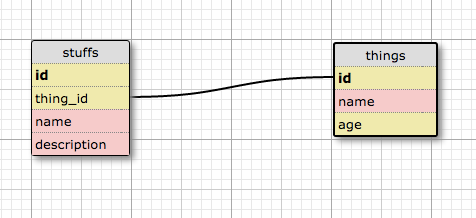

## Client Stories:
___
* Upon authentication, the admin can add, edit, delete and view a product from the store, which includes inventory level.

* A shopper can:
* select items and add them to cart
* items available reflect current inventory levels
* total price reflected in cart
* out of inventory items grayed out in cart
* inventory updated after an item is purchased
* receives confirmation email after purchases with summary
* has a user profile with order history sorted by date and time

## Schema Screenshot:

## Installation Notes:
* ruby 2.0.0p353
* rails 4.2.6

## Deployment details and link
[Ye Olde Rails Shoppe](https://cryptic-inlet-68243.herokuapp.com)

